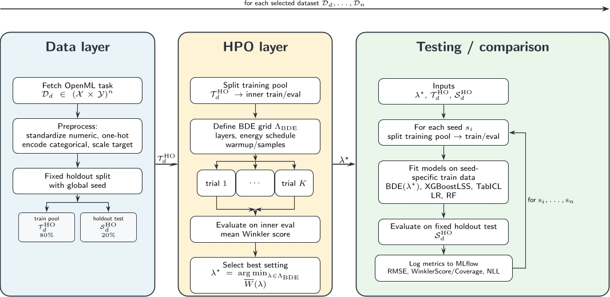

# Evaluating MILE-Based Bayesian Deep Ensembles

This repository contains the code for the benchmark experiments of my Bachelor's thesis:

**Evaluating MILE-Based Bayesian Deep Ensembles: A Benchmark for Predictive Accuracy and Uncertainty Quantification**

The benchmark loads selected OpenML regression datasets, preprocesses them, performs hyperparameter optimization for the Bayesian Deep Ensemble (BDE), and compares the resulting BDE model against additional tabular regression baselines across multiple random seeds.

The main benchmark is executed from `src/main.py`. Ablation studies are not part of the default benchmark run; they are performed by manually adjusting the BDE configuration and selected dataset.



## Project Structure

```text
.
├── README.md
├── pyproject.toml
├── pixi.lock
├── scripts/
│   └── patch_bde_patience_none.py
├── src/
│   ├── main.py
│   ├── config/
│   │   ├── config.py
│   │   └── metrics.py
│   ├── PreProcessing/
│   │   └── PreProcessing.py
│   ├── Orchestration/
│   │   ├── helpers.py
│   │   └── ablation_metrics.py
│   ├── data/
│   │   ├── mlflow.db
│   │   └── task_metadata_tabarena51.csv
│   ├── mlruns/
│   └── visuals/
└── archive/
    └── examples/
        ├── hpo_tables.ipynb
        ├── 4_4_Ablation.ipynb
        └── plot_test.ipynb
```

The most important files are:

- `src/main.py`: loads the data and runs the main benchmark.
- `src/config/config.py`: defines datasets, seeds, BDE hyperparameter grid, and MLflow paths.
- `src/config/metrics.py`: contains the implemented uncertainty metrics.
- `src/PreProcessing/PreProcessing.py`: loads OpenML datasets and applies preprocessing.
- `src/Orchestration/helpers.py`: creates summary tables and HPO parallel plots from MLflow runs.
- `src/Orchestration/ablation_metrics.py`: contains helper functions for ablation-specific tables.
- `archive/examples/`: contains exploratory notebooks used for thesis figures and additional analyses.

## Environment

The environment is managed with Pixi. The relevant dependency definitions are stored in:

- `pyproject.toml`
- `pixi.lock`

Use these files to reproduce the same package environment.

Install Pixi if it is not already available:

```bash
pip install pixi
```

Install the project environment:

```bash
pixi install
```

## MLflow Tracking

The benchmark logs all experiment results with MLflow.

Start the MLflow server in a separate terminal:

```bash
cd src
pixi run mlflow-server
```

The Pixi task is defined in `pyproject.toml` and uses:

```text
backend store: src/data/mlflow.db
artifact root: src/mlruns
port: 5001
```

The `src/mlruns` directory is created automatically once experiments are executed.

## Configuration

The benchmark is configured in `src/config/config.py`.

The main configuration values are:

```python
ROBUST_SEEDS = [24,35,123]
GLOBAL_SEED = 12

DATASETS = [
     "wine_quality",
     "healthcare_insurance_expenses", 
     "Another-Dataset-on-used-Fiat-500", 
     "miami_housing"
]

BDE_GRID = {
    "hidden_layers": ["[16,16]", "[32,32]", "[16,16,16,16]", "[32,32,32]"],
    "var_start_end": ["(0.5,0.1)", "(0.05,0.01)", "(0.005,0.001)", "(0.0005,0.0001)"],
    "warmup_steps_n_samples": ["(1000,200)", "(2500,500)", "(5000,1000)", "(10000,5000)"],
    "epochs": ["400"]
}

BDE_ACTIVE_OVERRIDE = {}
```

`DATASETS` controls which OpenML datasets are loaded. `BDE_GRID` controls the BDE hyperparameter combinations evaluated during HPO. `GLOBAL_SEED` controls the deterministic holdout split and model seed. `ROBUST_SEEDS` controls the repeated train subsplits used in the robustness comparison. `BDE_ACTIVE_OVERRIDE` is empty for the main benchmark and can be set to one of the ablation override dictionaries in `config.py` for additional ablation studies.

## Running The Main Benchmark

After installing the environment and starting MLflow, run the benchmark from the `src` directory:

```bash
cd src
pixi run python main.py
```

The main entry point is:

```python
if __name__ == "__main__":
    datasets = LoadData()

    for datasetname, dataset in datasets.items():
        try:
            runExperiment(
                datasetname=datasetname,
                dataset=dataset,
                seeds=ROBUST_SEEDS,
                global_seed=GLOBAL_SEED,
                n_trials=1,
                run_hpo=True,
            )
        except Exception as e:
            print(f"Dataset loading failed | Error: {e}")
```

The number of HPO trials and whether HPO is executed can be changed in the `runExperiment` call.

The function definition is:

```python
def runExperiment(datasetname, dataset, seeds, global_seed, run_hpo=False, n_trials=50):
```

The important parameters are:

- `datasetname`: name of the dataset to run.
- `dataset`: the loaded data dictionary containing `X` and `y`.
- `seeds`: list of robustness seeds.
- `global_seed`: seed used for the main holdout split.
- `run_hpo`: whether to run BDE HPO before the robustness test.
- `n_trials`: number of Optuna grid trials to evaluate.

If `run_hpo=False`, a previous HPO run for the same dataset must already exist in MLflow, because the robustness test loads the best BDE configuration from the latest `HPO_Study_<dataset>` run.

## Experiment Flow

The main benchmark follows this sequence:

1. `LoadData()` reads the configured dataset names from `src/config/config.py`.
2. The selected OpenML tasks are loaded using `src/data/task_metadata_tabarena51.csv`.
3. `PreProcessing()` creates the train/test split and applies scaling and one-hot encoding.
4. BDE HPO is performed with Optuna's `GridSampler`.
5. The best BDE configuration is selected according to the mean Winkler score.
6. The robustness comparison is performed across the configured `ROBUST_SEEDS`.
7. Results are logged to MLflow.

The HPO is only performed for the BDE model. Random Forest, Linear Regression, TabICL, and XGBoostLSS are evaluated with fixed configurations rather than separate HPO searches.

## Metrics

The benchmark evaluates predictive accuracy and uncertainty quality.

Implemented in `src/config/metrics.py`:

```python
def WinklerScore(y_val, pi_lower, pi_upper, alpha=0.1, returnCoverage=False):
```

```python
def GaussianNll(y, mu, sigma, eps=1e-6):
```

Logged metrics include:

- RMSE
- Mean Winkler Score
- Coverage
- Negative log-likelihood

## Results And Plot Generation

MLflow stores the experiment metadata in:

```text
src/data/mlflow.db
```

MLflow artifacts are written to:

```text
src/mlruns/
```

The helper functions in `src/Orchestration/helpers.py` create result tables and HPO visualizations from MLflow runs.

For summary tables:

```python
def create_table(experiment_id, run_id, dataname):
```

For BDE HPO parallel plots:

```python
def create_bde_hpo_parallel_plot(
    experiment_id,
    hpo_parent_run_id,
    dataname,
    param_cols,
    target_metric,
    visuals_dir=VISUALS,
    lower_is_better=True,
    color_metric=None,
    fixed_param_filters=None,
    color_group_param=None,
):
```

The user provides the relevant MLflow experiment ID, run ID, and dataset name. The helper then queries MLflow and exports the corresponding table or plot.

## Ablation Studies

Ablation studies are not executed automatically by `src/main.py`.

To perform an ablation study, manually adjust the relevant BDE settings in `src/config/config.py`, select the target dataset, and rerun the experiment. The standard HPO search space is controlled by `BDE_GRID`; additional fixed BDE changes after HPO are controlled by `BDE_ACTIVE_OVERRIDE`.

For the main benchmark, keep:

```python
BDE_ACTIVE_OVERRIDE = {}
```

For an ablation, set `BDE_ACTIVE_OVERRIDE` to one of the override dictionaries defined in `config.py`, for example:

```python
BDE_ACTIVE_OVERRIDE = BDE_EPOCHS_800_OVERRIDE
```

The final BDE parameters after applying the active override are logged to MLflow during the robustness run. The resulting MLflow run can then be processed with the orchestration helpers or the ablation notebooks.

The ablation helper module is:

```text
src/Orchestration/ablation_metrics.py
```

## Notebooks And Archived Analysis

The notebooks in `archive/examples/` were used for exploratory analysis and thesis figure generation. They are not required for the main benchmark execution.

Important notebooks:

- `archive/examples/hpo_tables.ipynb`: creates raw and aggregated HPO tables for a selected MLflow HPO run. To use it, update the `DATASET_SLUG`, `EXPERIMENT_ID`, and `HPO_PARENT_RUN_ID` values in the configuration cell and run the notebook sections needed for raw HPO tables, aggregated HPO tables, or early-stopping summaries. Outputs are written to `src/visuals/raw/`.
- `archive/examples/4_4_Ablation.ipynb`: creates the architecture ablation plots used in the thesis.
- `archive/examples/plot_test.ipynb`: creates epoch-vs-baseline plots.

Some thesis tables, such as manually written search-space definitions, were created separately and are stored as generated visual/table artifacts.

## Reproducibility Notes

- The project is designed around the Pixi environment defined by `pyproject.toml` and `pixi.lock`.
- Datasets are loaded from OpenML using task metadata in `src/data/task_metadata_tabarena51.csv`.
- MLflow stores experiment metadata in `src/data/mlflow.db`.
- The full benchmark can be computationally expensive and is not intended as a quick smoke test.
- The code path in `src/main.py` is the main reproducible benchmark path; notebooks are secondary analysis artifacts.
